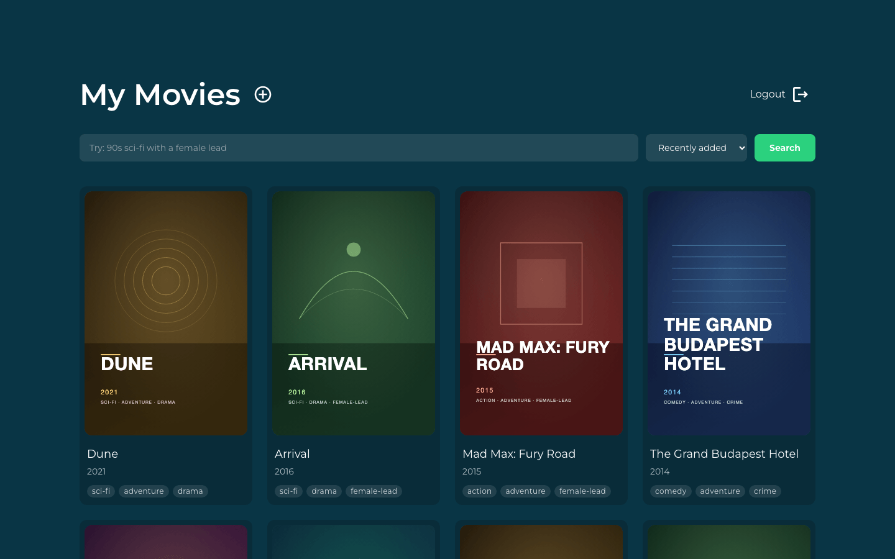
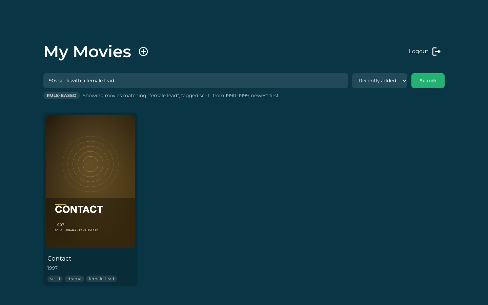
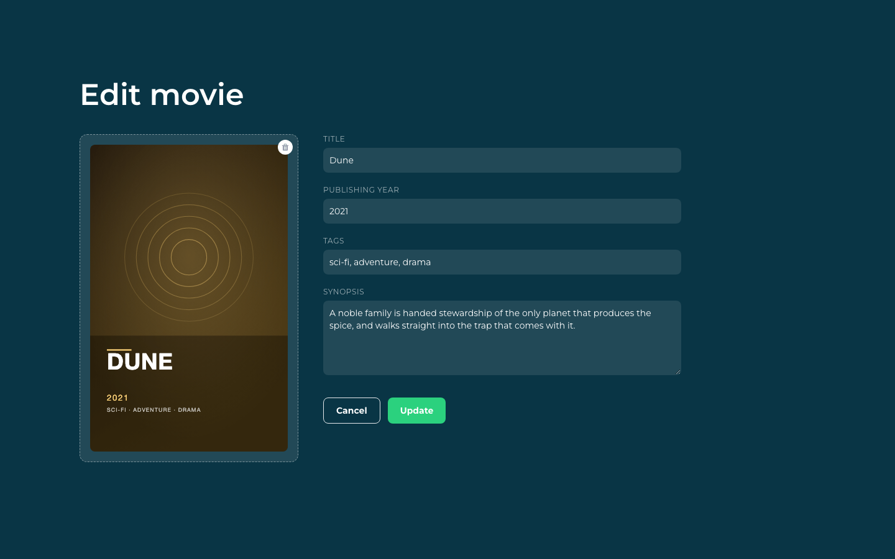
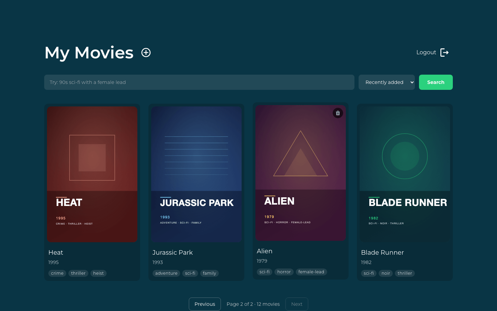
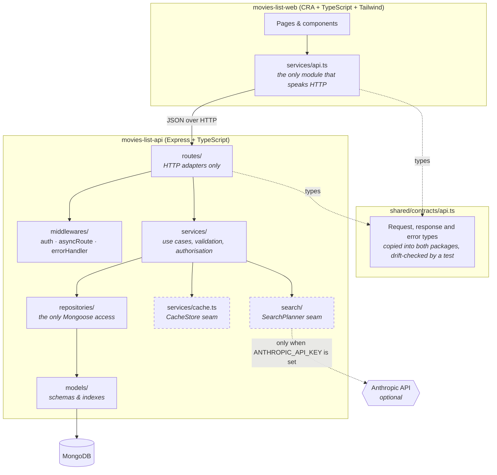
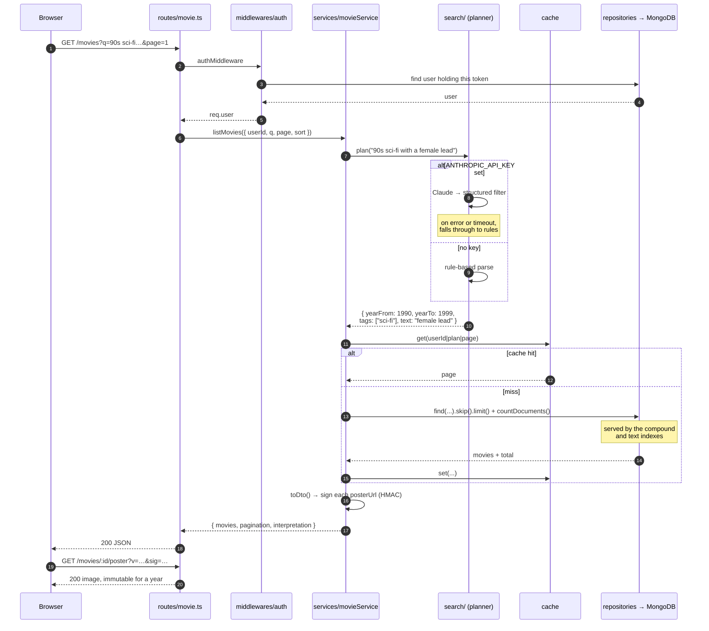

# Movies List

A personal movie collection you sign into and curate: add a film with a poster, a
year, a synopsis and tags, then find it again by typing what you remember —
"90s sci-fi with a female lead" — rather than by scrolling. It is two packages,
a TypeScript Express API backed by MongoDB (`movies-list-api`) and a Create React
App + Tailwind client (`movies-list-web`), sharing one typed HTTP contract.

Natural-language search works with no API key configured: a rule-based planner
parses the sentence. Setting `ANTHROPIC_API_KEY` upgrades that planner to Claude,
and the UI tells you which one answered.

## Screenshots

| The collection | Natural-language search |
| --- | --- |
|  |  |

| Editing a movie | Paging through the collection |
| --- | --- |
|  |  |

All four are real screens against the seeded demo collection, captured with
Playwright at 1440x900. The poster art is generated by the seeder as SVG
(`movies-list-api/src/db/posterArt.ts`) — no stock images are shipped.

## Architecture

The API is layered, and dependencies point inward. Each layer may call the one
below it and never the one above: an HTTP concern never reaches the database, and
a database concern never reaches into HTTP.



The pattern is a **ports-and-adapters / layered hybrid**: routes are inbound
adapters, repositories are the outbound adapter to MongoDB, and `SearchPlanner`
and `CacheStore` are named interfaces with swappable implementations. Business
rules live in `services/` and depend on interfaces, never on Express or Mongoose.

## How a search request flows

The interesting path is a movie list request carrying a free-text query, because
it touches every seam: the planner, the cache, the indexes and the poster URLs.



## Quickstart

### Docker (recommended)

One command brings up MongoDB, seeds a demo collection with generated poster art,
and starts both the API and the web client:

```bash
JWT_SECRET=$(openssl rand -base64 48) docker compose up --build
```

| Service | URL |
| --- | --- |
| Web client | <http://localhost:8290> |
| API | <http://localhost:8291> |
| API health | <http://localhost:8291/health> |

Sign in with **test@example.com** / **password123** (override with `SEED_EMAIL`
and `SEED_PASSWORD`). MongoDB is not published to the host.

To enable AI-assisted search, add a key — everything else is unchanged:

```bash
JWT_SECRET=$(openssl rand -base64 48) ANTHROPIC_API_KEY=sk-ant-... docker compose up --build
```

Tear it down with `docker compose down -v`.

> `JWT_SECRET` has no default. Compose refuses to start without it, because a
> defaulted signing secret is the same as no authentication at all.

## Configuration

API (`movies-list-api`), read through `src/config/env.ts`:

| Variable | Required | Default | Purpose |
| --- | --- | --- | --- |
| `JWT_SECRET` | **yes** | _none — throws_ | Signs and verifies JWTs, and derives the poster URL signing key. Generate with `openssl rand -base64 48`. |
| `MONGODB_URI` | **yes** | _none — throws_ | MongoDB connection string, without the database name. |
| `MONGODB_DB` | no | `movie-list` | Database name appended to `MONGODB_URI`. |
| `PORT` | no | `3001` | Port the API listens on. |
| `CORS_ORIGINS` | no | `*` | Comma-separated allowed origins. Pin this in any real deployment. |
| `MAX_UPLOAD_BYTES` | no | `5242880` (5 MB) | Largest poster upload accepted. |
| `LIST_CACHE_TTL_MS` | no | `30000` | How long a movie-list page stays cached. |
| `ANTHROPIC_API_KEY` | no | _unset_ | Enables AI-assisted search. Unset means the rule-based planner is used. |
| `ANTHROPIC_MODEL` | no | `claude-opus-5` | Model used for search planning. |
| `SEED_EMAIL` | no | `test@example.com` | Demo account created by `npm run db:seed`. |
| `SEED_PASSWORD` | no | `password123` | Demo account password. |

Web (`movies-list-web`) — Create React App inlines these at **build** time:

| Variable | Required | Default | Purpose |
| --- | --- | --- | --- |
| `REACT_APP_SERVER_URL` | no | `http://localhost:3001` | Base URL of the API as the *browser* reaches it. Compose sets it to `http://localhost:8291`. |

Copy `movies-list-api/.env_sample` to `movies-list-api/.env` for local runs;
`.env` is git-ignored.

## Development

Without Docker you need a MongoDB reachable at `MONGODB_URI`.

```bash
# install
npm install --prefix movies-list-api
npm install --prefix movies-list-web

# configure
cp movies-list-api/.env_sample movies-list-api/.env
#   then set JWT_SECRET in that file

# seed a demo collection (safe to re-run)
npm run db:seed

# run both packages (web on :3000, API on :3001)
npm install          # root, for concurrently
npm start
```

Useful scripts, all runnable from the repository root:

| Command | What it does |
| --- | --- |
| `npm test` | Full suite: 161 API tests + 83 web tests. |
| `npm run typecheck` | `tsc --noEmit` over both packages. |
| `npm run lint` | ESLint over the API sources. |
| `npm run format:check` | Prettier check over the API sources. |
| `npm run build` | Compiles the API to `dist/` and builds the web bundle. |
| `npm run db:seed` | Seeds the demo user, movies and poster art, and syncs indexes. |
| `npm run contract:sync` | Regenerates the per-package copies of the shared contract. |

Per-package: `npm --prefix movies-list-api test`, `npm --prefix movies-list-web test`.

> **bcrypt on a machine with `ignore-scripts=true`.** `bcrypt` is a native module
> whose binary is fetched by a postinstall script. If npm is configured globally
> with `ignore-scripts=true`, `npm install` succeeds but the binary is missing and
> the API fails at runtime with `Could not locate the bindings file`. Fix it with:
>
> ```bash
> npm rebuild bcrypt --build-from-source --prefix movies-list-api
> # or, to allow just this package's scripts:
> npm install --prefix movies-list-api --ignore-scripts=false
> ```
>
> The Docker path is unaffected — the image builds `bcrypt` itself.

### API surface

| Method | Path | Notes |
| --- | --- | --- |
| `POST` | `/login` | `{ email, password }` → `{ token, user }`. |
| `POST` | `/logout` | Bearer token; revokes that exact session. |
| `GET` | `/health` | `200` when MongoDB is connected, `503` otherwise. |
| `GET` | `/movies` | `page`, `pageSize`, `q`, `sort`. Returns movies, pagination and the search interpretation. |
| `POST` | `/movies` | `multipart/form-data`; a poster is required. |
| `GET` | `/movies/:id` | Single movie. |
| `PUT` | `/movies/:id` | `multipart/form-data`; the poster is only replaced if one is sent. |
| `DELETE` | `/movies/:id` | Removes the movie. |
| `GET` | `/movies/:id/poster` | Signed, immutable poster bytes. |

Every error response has the same shape: `{ message, code }`, where `code` is one
of the `ERROR_CODES` in the shared contract.

A Postman collection lives in `postman/`.

## Project structure

```
movies-list/
├── shared/contracts/api.ts     # SOURCE OF TRUTH for the HTTP contract
├── scripts/sync-contracts.js   # copies it into both packages
├── docker-compose.yml          # mongo + seed + api + web
│
├── movies-list-api/
│   └── src/
│       ├── app.ts              # express wiring; no routes of its own
│       ├── index.ts            # boot: validate config, connect, sync indexes
│       ├── config/env.ts       # every env var, read lazily; required ones throw
│       ├── contracts/api.ts    # generated copy of the shared contract
│       ├── routes/             # HTTP adapters: read request, call service, respond
│       ├── middlewares/        # auth, asyncRoute, errorHandler
│       ├── services/           # use cases — the layer worth reading first
│       │   ├── movieService.ts #   list/create/update/delete, poster access
│       │   ├── authService.ts  #   login, authenticate, logout
│       │   ├── posterUrl.ts    #   HMAC capability URLs for posters
│       │   └── cache.ts        #   CacheStore interface + TTL implementation
│       ├── search/             # SearchPlanner seam
│       │   ├── types.ts        #   the interface + plan description
│       │   ├── heuristicPlanner.ts  # always-available rule-based planner
│       │   ├── anthropicPlanner.ts  # optional, falls back on any failure
│       │   └── index.ts        #   registry: picks one, allows substitution
│       ├── repositories/       # the ONLY Mongoose access in the codebase
│       ├── models/             # schemas and index declarations
│       ├── errors/httpError.ts # typed errors carrying status + contract code
│       ├── db/                 # connection, seeder, generated poster art
│       └── __tests__/          # 161 tests
│
└── movies-list-web/
    └── src/
        ├── contracts/api.ts    # generated copy of the shared contract
        ├── services/
        │   ├── api.ts          # the only module that speaks HTTP
        │   └── session.ts      # the only module that knows where the token lives
        ├── pages/              # Signin, Movies, NewMovie, EditMovie
        ├── components/         # Button, Input, MovieCard, SearchBar, Pagination…
        ├── routes/Router.tsx   # lazily-loaded routes
        └── schemas/            # Yup form schemas
```

## Design notes

### One contract, two packages

The API and the client used to agree on response shapes by coincidence. They now
share `shared/contracts/api.ts`, which `npm run contract:sync` copies into each
package (Create React App refuses to compile imports from outside `src/`, so a
copy is the pragmatic answer). A test in **both** packages fails if its copy
drifts from the source, so the duplication cannot rot silently.

### Business logic out of the route handlers

Routes are eight-line adapters. Validation, authorisation and persistence moved
into `services/` and `repositories/`, which is what made the rest of this work
possible: the movie list could be paginated, cached and re-planned without any
of those changes touching an Express handler. It is also why the screenshots in
this README could be captured with no database at all — swapping the two
repository modules for in-memory arrays is enough to run the entire API.

### The bottleneck: the list endpoint returned the whole collection, posters and all

`GET /movies` had no pagination and no projection, and each movie carried its
poster inline as a base64 `Buffer`. A 40-film collection was a multi-megabyte
JSON response that the browser then had to turn back into blobs. Four changes:

1. **Pagination.** `page`/`pageSize`, capped at 100, defaulting to 12.
2. **Projection.** Poster bytes are excluded from every query except the poster
   route itself (`MOVIE_PROJECTION`).
3. **Posters moved to their own cacheable endpoint.** Because an `` tag
   cannot send an `Authorization` header, each poster gets a *capability URL*:
   an HMAC over (owner, movie, content hash), derived from `JWT_SECRET`. The URL
   is unguessable, scoped to one image, and — since the content hash is in both
   the signature and the query string — safe to serve `immutable` for a year.
   Replacing a poster changes the hash, which invalidates the old URL for free.
4. **Indexes that match the queries.** Every list query filters by `userId` then
   sorts, so there are compound indexes on `{userId, createdAt}`,
   `{userId, publishYear}`, `{userId, title}` and `{userId, tags}`, plus a
   weighted text index over title/synopsis/tags. Without them MongoDB collection-
   scans and sorts in memory, which fails outright past 32 MB of matches.

A short-TTL read-through cache sits in front of the list query, keyed by user,
plan and page, and every write drops that user's cached pages by key prefix. The
cache is bounded — an unbounded map keyed by user and query is a memory leak
wearing a cache costume.

On the client, routes are lazily loaded. Measured over the real build:

| First-paint JavaScript | Before | After | |
| --- | --- | --- | --- |
| `/movies` (the list) | 318,333 B raw · 98,810 B gz | **180,422 B raw · 60,152 B gz** | −43% / −39% |
| `/signin` | 318,333 B raw · 98,810 B gz | **248,889 B raw · 80,740 B gz** | −22% / −18% |

Before, every route shipped every page. Now the list route no longer carries the
form stack (Formik, Yup, the dropzone) it never uses. Total bytes across all
chunks grew slightly, because search, pagination and the shared contract are new
code — but nobody downloads all of it up front.

### The seam: `SearchPlanner`

The extension point a future developer actually needs here is *how a human
sentence becomes a query*, because that is the part most likely to be replaced.

```ts
export interface SearchPlanner {
  readonly name: string;
  plan(query: string): Promise<SearchPlan>;
}
```

Two implementations ship. `heuristicPlanner` is rule-based, always available and
has no dependencies. `anthropicPlanner` calls Claude with a structured-output
schema and **falls back to the heuristic planner on every failure path** — no
key, network error, malformed output, or an 8-second timeout. A registry in
`search/index.ts` picks one at startup and `setSearchPlanner()` lets a test or a
future provider substitute another without the service layer knowing which is in
play. Search therefore degrades in quality but never in availability, and no test
makes a real API call — the AI planner's tests inject a fake client.

The same shape is used for caching: `CacheStore` has one in-process
implementation today, and a Redis one can replace it for a horizontally scaled
deployment without any caller changing.

Because the planner returns its reading of the query, the UI can show it — the
"RULE-BASED" / "AI SEARCH" badge and the sentence beneath the search box are that
interpretation rendered. A search that misunderstands you says so.

### Security

Three fixes from the previous audit are load-bearing and deliberately preserved:

- **No fallback JWT secret.** `getJwtSecret()` throws when `JWT_SECRET` is unset.
  There is no default anywhere in the codebase, and the API refuses to boot
  without one.
- **`POST /login` with an empty body is rejected.** Mongoose strips `undefined`
  filters, so `findOne({ email: undefined })` returns an arbitrary user. The
  service checks both fields are non-empty strings before querying.
- **`POST /logout` verifies the presented token is the stored one**, so a stale
  token cannot revoke whoever currently holds the account.

Posters are served with `X-Content-Type-Options: nosniff` and a restrictive CSP,
because SVG can carry script.

> **Rotate `JWT_SECRET` before deploying this.** An earlier development secret is
> present in this repository's git history.

## Limitations

- **One session per user.** The token is stored on the user document, so signing
  in on a second device signs the first one out. A sessions collection would fix
  it; a single-user collection manager did not need it.
- **Posters are stored in MongoDB.** Fine at this scale and it keeps the stack to
  one datastore, but object storage with a CDN is the real answer past a few
  thousand images. The capability-URL scheme was designed so that move is a
  change to `posterUrl.ts` and the poster route only.
- **The cache is per-process.** Two API containers keep two caches, so a write on
  one is invisible to the other for up to `LIST_CACHE_TTL_MS`. The `CacheStore`
  interface exists so that Redis can replace it; that has not been done.
- **No sign-up flow.** Accounts come from the seeder. This is a personal
  collection manager, not a multi-tenant product.
- **Search is single-language and literal.** The rule-based planner knows a fixed
  list of genre words and date phrasings. The AI planner is much better at prose
  but needs a key, and neither does semantic similarity over synopses.
- **No refresh tokens or rate limiting.** Tokens last an hour and login is not
  throttled.
- **Tags are free text.** There is no controlled vocabulary or rename tooling, so
  `sci-fi` and `scifi` are different tags if you type both.
